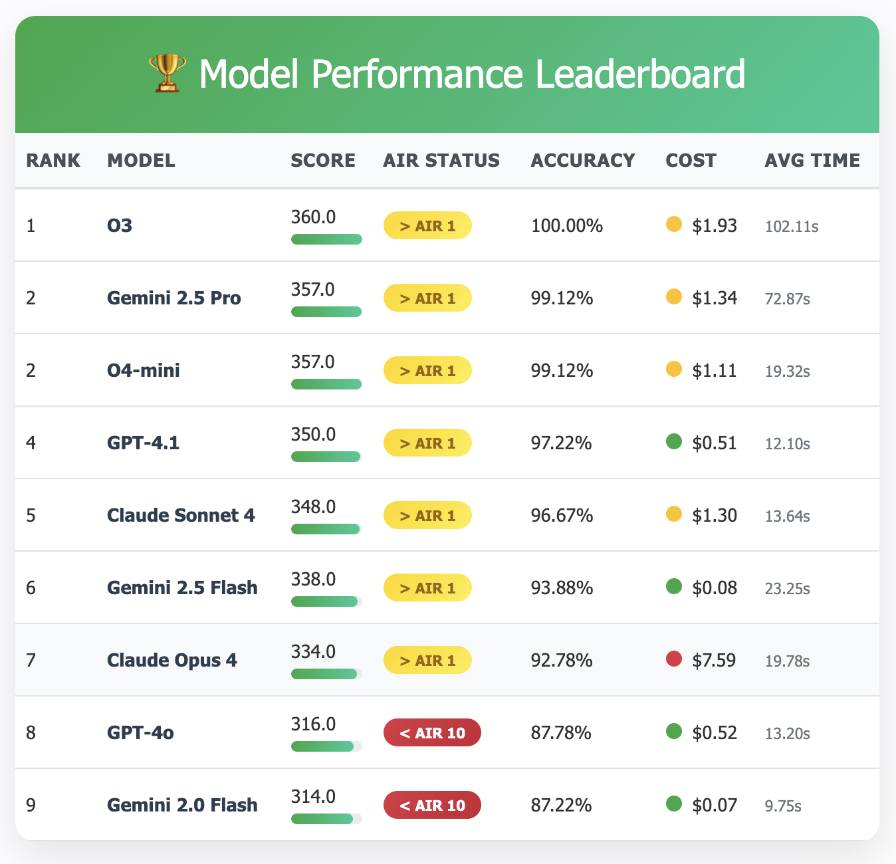

# jeeBench

**LLM Evaluation on JEE Advanced 2025 Question Papers**

jeeBench benchmarks Large Language Models (LLMs) on Joint Entrance Examination (JEE) Advanced 2025 papers. It extracts questions from PDFs, evaluates them with multiple AI providers (Anthropic, OpenAI, Google), and generates performance analytics.

## Results



## Quick Setup

### 1. Install Dependencies
```bash
pip install -r requirements.txt
```

### 2. Set API Keys
Copy `.env.local` → `.env` file:
```bash
ANTHROPIC_API_KEY=your_key_here
OPENAI_API_KEY=your_key_here
GOOGLE_API_KEY=your_key_here
```

### 3. Prepare Data
```
data/
├── inputs/
│ ├── question_papers/ # Place JEE PDF papers here
│ ├── syllabus/ # jee_syllabus.json
│ └── scoring/ # jee_2025_scoring.json
└── outputs/ # Results will be generated here
```

## Workflow Summary

1. **Extract** → PDF papers become structured question data
2. **Solve** → AI models answer questions, get scored using JEE rules
3. **Analyze** → Generate comparative performance reports

**Output:** Excel file with complete model comparison and AIR rankings based on human topper scores.

## Usage

### Step 1: Extract Questions from PDFs
```bash
python 01_extract_questions_to_json.py
```
- Processes PDF papers in `data/inputs/question_papers/`
- Creates question metadata and images
- Output: `question_metadata_jee_2025.json`

### Step 2: Solve Questions with AI Models
```bash
# Single model
python 02_solve_questions.py --provider anthropic --model claude-sonnet-4-20250514

# All models from a provider
python 02_solve_questions.py --provider openai --model all

# All providers and models
python 02_solve_questions.py --provider all

# Faster parallel processing
python 02_solve_questions.py --provider anthropic --parallel
```
- Sends questions to AI models
- Evaluates responses using JEE scoring rules
- Output: Individual result JSON files per model

### Step 3: Generate Analytics Report
```bash
python 03_consolidate_jee_results.py
```
- Consolidates all model results
- Creates comprehensive Excel report with:
  - Overall model comparison with AIR rankings
  - Subject-wise performance (Physics, Chemistry, Math)
  - Unit-wise analysis
  - Cost efficiency metrics

## Supported Models

- **Anthropic:** Claude Sonnet 4, Claude Opus 4
- **OpenAI:** GPT-4o, GPT-4.1, O3, O4-mini
- **Google:** Gemini 2.5 Flash, Gemini 2.0 Flash, Gemini 2.5 Pro

## Key Features

- **Question Types:** MCQ, Multiple Correct, Numerical, Pair Matching
- **JEE Scoring:** Official scoring rules with partial credit
- **Analytics:** Performance by subject/unit/difficulty + cost tracking
- **Parallel Processing:** Faster evaluation with `--parallel` flag

## Collaboration

Contributions to expand jeeBench! Here are areas where you can help:

### Expansion Opportunities

#### 📚 **More Examination Papers**
- [ ] Older JEE papers
- [ ] NEET (National Eligibility cum Entrance Test)
- [ ] GATE (Graduate Aptitude Test in Engineering)
- [ ] CAT/GMAT (Management entrance exams)
- [ ] SAT/GRE (International standardized tests)

#### 🤖 **Additional AI Models**
- [ ] Meta: Llama 3.2/3.3 models, Llama 3.2
- [ ] Mistral: Mistral Large, Mixtral 8x7B
- [ ] Sarvam-M
- [ ] Other Models: Qwen, DeepSeek, etc.

Fork the repository, make your changes, and submit a pull request!
